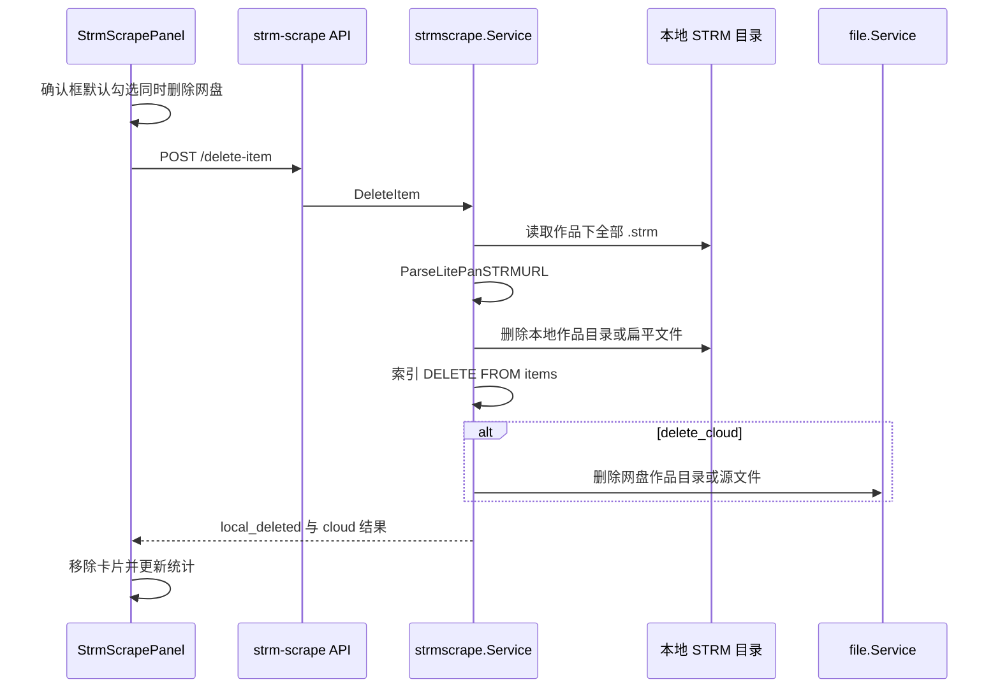

# STRM 刮削海报墙删除作品

Feature Name: strm-scrape-delete-work
Updated: 2026-09-04

## Description

在 STRM 刮削海报墙为每张作品卡片增加删除入口。确认后先解析 `.strm` 中的网盘 `file_id`，再删除本地作品目录（或扁平 `.strm` 及对应元数据），从刮削索引移除该条目。默认勾选「同时删除网盘内容」时，目录作品删除对应网盘作品目录，扁平作品只删除对应网盘文件。本地删除成功后海报墙立即移除该卡片；网盘失败以警告提示，不回滚本地删除。

## Architecture



删除路径复用现有刮削服务与文件服务，不新增独立进程。本地解析必须发生在删除本地文件之前。网盘目录定位依赖 STRM 扫描保留的相对目录结构：本地作品 `rel_dir` 对应任务源根 `ParentID` 下的同名相对路径。

## Components and Interfaces

### 前端 `web/src/components/admin/StrmScrapePanel.vue`

卡片操作区增加危险样式「删除」按钮，刮削进行中或该卡片忙时禁用。点击后调用 `confirm`：标题「删除作品」，勾选项「同时删除网盘内容」默认勾选。成功后从 `items` 移除该卡，并按该卡原 `status` 扣减 `stats`。

### 前端 API `web/src/api/strmScrape.ts`

新增 `deleteStrmScrapeItem({ strm_task_id, item_id, delete_cloud })`，请求 `POST /admin/strm-scrape/delete-item`。

### 路由 `internal/api/router.go` / `internal/api/strm_scrape.go`

管理员路由增加 `POST /delete-item`，请求体 `strm_task_id`、`item_id`、`delete_cloud`，转给 `strmscrape.Service.DeleteItem`。

### `internal/strmscrape.Service`

新增 `Files *file.Service` 依赖（`wire_services.go` 注入现有 `fileSvc`）。`DeleteItem` 持有 `operationMu` 与 `TryBeginTaskFileOperation`，流程：

1. `resolveTask` + `findWorkByID`，校验作品路径落在任务输出根内
2. 读取全部 `.strm`，用 `proxybase.ParseLitePanSTRMURL` 收集与任务账号一致的 `file_id`
3. 若 `delete_cloud` 且为目录作品：从 `task.ParentID` 沿 `rel_dir` 分段 `List` 解析网盘作品目录 ID；解析结果等于任务源根则降级为删文件
4. 删除本地：目录作品 `os.RemoveAll(absDir)`；扁平作品删除该 `.strm` 及 `clearFlatScrapedMetadata`
5. 索引 `DELETE FROM items WHERE id=?`
6. 若 `delete_cloud`：优先 `DeleteFiles` 网盘作品目录，失败或无法定位则按 `file_id` 列表删除

### 网盘目录解析

`FileItem` 不含 `ParentID`，不能从文件向上走。STRM 扫描用 `LocalRelPath(taskRelDir, relDirs, fileName)` 把远端相对目录镜像到本地，因此本地作品 `rel_dir` 可反向映射到 `task.ParentID`。逐段 `List` 匹配 `SafeName(child.Name)`；任一段找不到则退回按 `file_id` 删文件。

## Data Models

```text
DeleteItemRequest
  strm_task_id int64
  item_id string
  delete_cloud bool

DeleteItemResult
  item_id string
  local_deleted bool
  cloud_requested bool
  cloud_deleted bool
  cloud_target string   // folder 或 files
  cloud_error string    // 网盘失败原因，可空
```

刮削索引表结构不变，仅增加按 `id` 删除一行。

## Correctness Properties

- 删除范围仅限当前 STRM 任务输出根内、索引 `item_id` 对应的一部作品
- 扁平作品不得删除库根目录，也不得删除同目录其它作品文件
- 网盘侧不得删除 STRM 任务源根 `ParentID`
- 账号 ID 与任务账号不一致的 `.strm` 不参与网盘删除
- 本地文件删除前必须完成 `.strm` 解析
- 本地删除成功后索引条目必须移除，海报墙不再展示该卡

## Error Handling

| 场景 | 处理 |
|------|------|
| 刮削或 STRM 文件操作进行中 | 返回校验错误，本地与网盘均不改 |
| `item_id` 不存在或路径越出输出根 | 返回校验错误 |
| 本地删除失败 | 返回错误，索引与海报墙保持原样 |
| 本地已不存在 | 仍删除索引并视为本地成功 |
| `.strm` 无法解析 | 跳过该文件的网盘删除 |
| 网盘目录定位失败 | 改为删除已解析的源文件 `file_id` |
| 网盘删除失败 | 本地与索引已生效；返回 `cloud_error`，前端警告 |

## Test Strategy

- 解析 `.strm`：合法 LitePan play URL 得到账号与 `file_id`；损坏内容被跳过
- 扁平作品：只删目标 `.strm` 与对应 nfo/海报，同目录其它作品保留
- 目录作品：`RemoveAll` 作品根，库内其它作品保留
- 网盘目录：`rel_dir` 可解析且不等于任务源根时删除目录；源根或解析失败时只删文件
- 账号不匹配的 `file_id` 不进入删除列表
- 索引在本地成功后移除对应 `id`
- 前端确认框默认 `delete_cloud=true`

## References

- 当前工作区 `/web/src/components/admin/StrmScrapePanel.vue` 海报墙卡片操作区
- 当前工作区 `/internal/strmscrape/scan.go` 作品分组与扁平作品
- 当前工作区 `/internal/proxybase/proxybase.go` `ParseLitePanSTRMURL`
- 当前工作区 `/internal/file/service.go` `DeleteFiles` / `List`
- 当前工作区 `/internal/strm/scanner.go` 远端相对目录到本地 STRM 的映射
